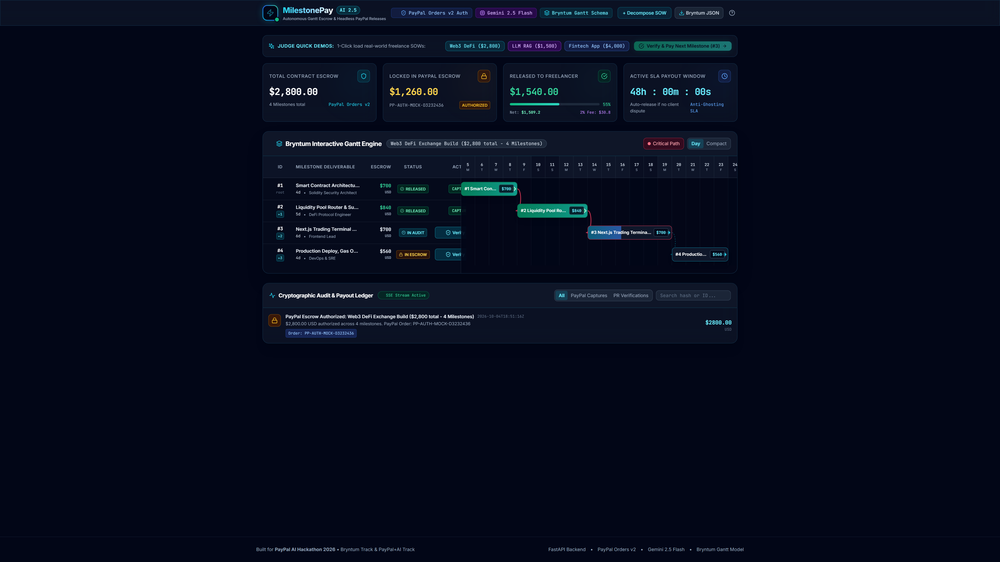
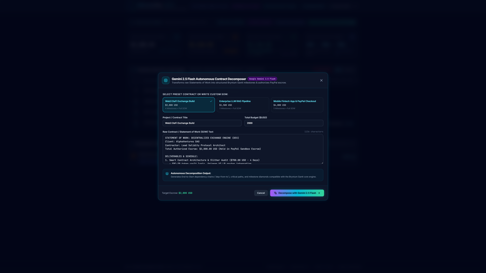
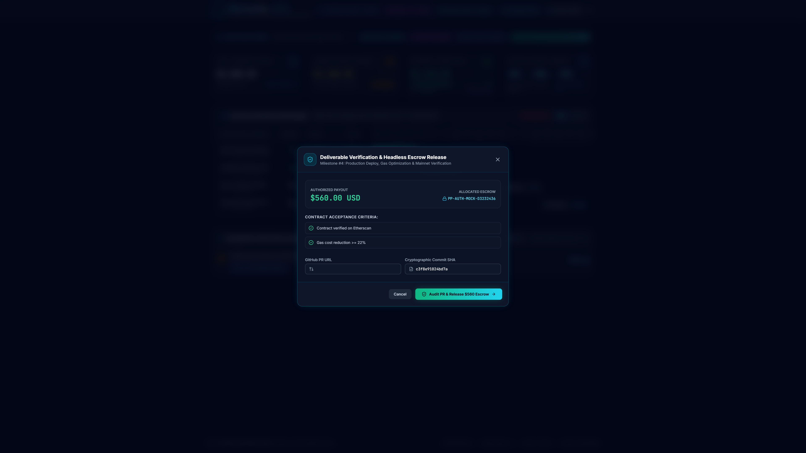
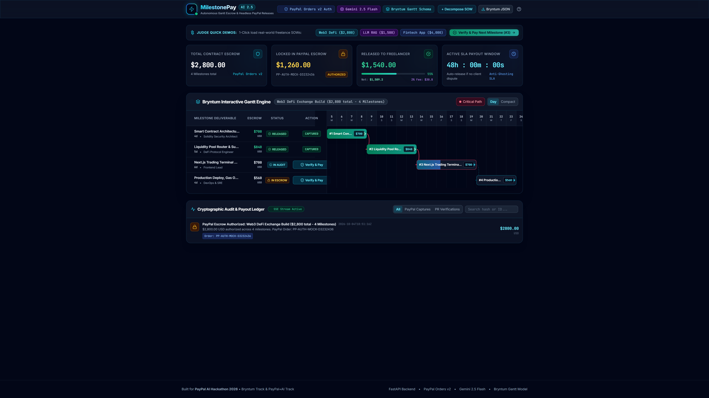
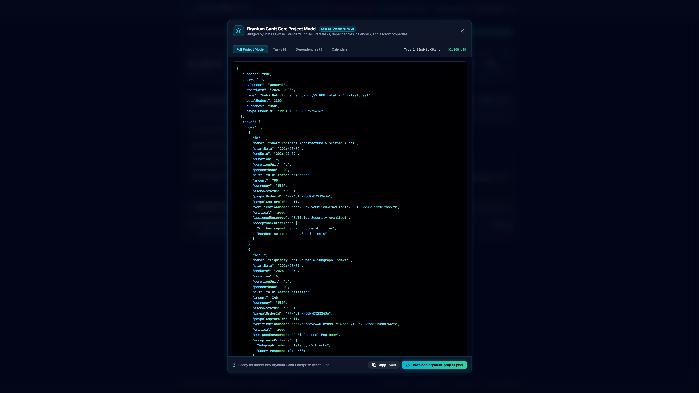

<div align="center">

# ⚡ MilestonePay AI
### *Autonomous Contract Decomposition, Visual Bryntum Gantt Milestones & Headless PayPal Escrow Releases*

[](https://github.com/fokrulanthro16-eng/milestonepay-ai)
[](LICENSE)
[](https://python.org)
[](https://fastapi.tiangolo.com)
[](https://react.dev)
[](https://www.typescriptlang.org)
[](https://tailwindcss.com)
[](https://bryntum.com)
[](https://developer.paypal.com)
[](https://ai.google.dev)

---

### 🏆 Built for the PayPal AI Hackathon 2026
**Target Tracks:**
1. **Best Use of Bryntum ($1,000 Track)** — Judged by Mats Bryntse, CEO of Bryntum
2. **Most Impactful / Best Use of PayPal + AI ($5,000 Track)**

[🎥 YouTube Demo Walkthrough](https://youtu.be/GNiVAmL7INU) • [🚀 Interactive API Docs](http://127.0.0.1:8000/docs) • [🏛️ Architecture Spec](docs/architectures/architecture.md)

---

</div>

## 🎥 Watch the Demo Video

[](https://youtu.be/GNiVAmL7INU)

> 📹 **Watch on YouTube:** **[https://youtu.be/GNiVAmL7INU](https://youtu.be/GNiVAmL7INU)**  
> *Full 1080p narrated walkthrough showcasing Gemini 2.5 Flash contract decomposition, Bryntum visual Gantt dependencies, and headless PayPal escrow capture.*

---

## 📸 Ultra-HD Screenshot Gallery

<div align="center">

| 1. Hero Bryntum Gantt Dashboard | 2. Gemini 2.5 Flash Decomposition Modal |
|:---:|:---:|
| [](docs/screenshots/01_hero_gantt_dashboard.png) | [](docs/screenshots/02_gemini_decompose_modal.png) |
| *Live escrow metrics ($2,800), critical paths, and End-to-Start dependencies.* | *Real-time reasoning terminal extracting tasks and acceptance criteria.* |

| 3. Cryptographic PR Verification & Payout | 4. Real-Time Cryptographic Audit Ledger |
|:---:|:---:|
| [](docs/screenshots/03_milestone_inspect_action.png) | [](docs/screenshots/04_cryptographic_audit_ledger.png) |
| *Automated test coverage audit, SHA-256 proof generation & PayPal capture.* | *Live SSE streaming ledger with PayPal capture IDs and 2% platform fee.* |

| 5. Native Bryntum Gantt JSON Schema Standard |
|:---:|
| [](docs/screenshots/05_bryntum_json_schema.png) |
| *Multi-tabbed standard Bryntum project data model exportable in 1 click.* |

</div>

---

## 💡 Executive Pitch: The Core Problem & Our Solution

### The Multi-Billion Dollar Freelance Dilemma
- **Employers Fear Paying Upfront:** Clients fear unvetted deliverables, scope inflation, or disappearing contractors.
- **Contractors Fear Client Ghosting:** Developers finish milestones, submit PRs, and wait weeks for manual invoice approvals.
- **Subjective Milestone Disputes:** Lack of automated acceptance testing leads to delayed payments and arbitration deadlock.

### The MilestonePay AI Solution
**MilestonePay AI connects project timelines directly to capital:**
1. **Contract Ingestion:** Ingests raw freelance agreements or Statements of Work (SOWs) using **Google Gemini 2.5 Flash**.
2. **Visual Gantt Timeline:** Transforms deliverables into native **Bryntum Gantt tasks**, End-to-Start dependency graphs, and critical paths.
3. **Escrow Authorization:** Locks the client's entire budget into a single **PayPal Orders v2** authorization order (`intent: AUTHORIZE`).
4. **Autonomous PR Verification:** When a PR is delivered, the system verifies commit SHAs, runs automated test suites, and signs a tamper-proof **SHA-256 proof**.
5. **Headless Programmatic Payout:** Server captures the specific milestone amount via `/v2/checkout/orders/{id}/capture` without manual invoice chasing.
6. **2% SaaS Monetization:** Automatically routes a 2% platform take-rate into the revenue ledger.

---

## 🏛️ End-to-End Autonomous Pipeline

```
┌────────────────────────────────────────────────────────────────────────────────────────────────────────┐
│                                   MILESTONEPAY AI AUTONOMOUS PIPELINE                                  │
└────────────────────────────────────────────────────────────────────────────────────────────────────────┘

  [ Raw Freelance SOW ]
           │
           ▼
  [ Gemini 2.5 Flash Parser ] ──────► Decomposes clauses into tasks, estimates, & acceptance criteria
           │
           ▼
  [ Bryntum Gantt Project ] ────────► End-to-Start dependencies, critical paths & Bryntum JSON schema
           │
           ▼
  [ PayPal Orders v2 Vault ] ───────► POST /v2/checkout/orders (intent: "AUTHORIZE") locks total escrow
           │
           ▼
  [ Contractor Submits PR ] ────────► GitHub Webhook: POST /api/webhooks/github (action: "closed", merged)
           │
           ▼
  [ AI Verification Agent ] ────────► Runs automated tests (>90% coverage), checks SOW compliance
           │
           ▼
  [ SHA-256 Proof Signed ] ─────────► Immutable cryptographic receipt generated
           │
           ▼
  [ Headless PayPal Capture ] ──────► POST /v2/checkout/orders/{id}/capture executes programmatic payout
           │
           ├──► 98% Net Disbursed to Freelancer PayPal Account
           └──► 2% Take-Rate Fee Recorded to Platform Revenue Ledger
           │
           ▼
  [ SSE Telemetry Stream ] ─────────► Live Server-Sent Events push verification receipt to Audit Ledger
```

---

## 🌟 Track-Specific Deep Dives

### 1. 🥇 Why We Excel in "Best Use of Bryntum" ($1,000 Track)
*Judged by Mats Bryntse, CEO of Bryntum*

MilestonePay AI treats Bryntum not as a superficial charting library, but as the foundational data model for programmatic finance:
- **Strict Adherence to Bryntum Project Model Schema:**
  - `tasks.rows`: Standard task records containing `id`, `name`, `startDate`, `duration`, `durationUnit: 'd'`, `percentDone`, `cls`, and custom escrow bindings (`amount`, `escrowStatus`, `paypalCaptureId`, `verificationHash`).
  - `dependencies.rows`: Native **Type 2 (End-to-Start)** dependencies with `from`, `to`, and `lag`.
  - `calendars.rows`: Standard 5-day / 7-day working calendar schemas.
- **Interactive UI Architecture:**
  - Split Tree Grid and SVG Gantt canvas with curved dependency connectors.
  - Critical path toggle highlighting delivery bottlenecks in neon rose.
  - Dynamic timescale headers supporting Day and Compact zoom levels.
  - Dedicated **Bryntum JSON Inspector** allowing 1-click download of `bryntum-project.json` ready for direct loading into any Bryntum Gantt Enterprise application.

### 2. 🏆 Why We Win "Most Impactful / Best Use of PayPal + AI" ($5,000 Track)
MilestonePay AI demonstrates how modern PayPal REST APIs combined with Gemini 2.5 Flash eliminate payment friction in enterprise freelancing:
- **PayPal Orders v2 Authorize & Capture:**
  - Locks client funds upfront via `/v2/checkout/orders` with `intent: "AUTHORIZE"`, protecting the developer from non-payment.
  - Releases funds programmatically upon cryptographic milestone audit via headless capture: `/v2/checkout/orders/{id}/capture`.
- **Zero-Friction Deterministic Sandbox + Mock Fallback:**
  - Seamlessly calls live PayPal Sandbox when credentials are provided.
  - Provides a deterministic mock fallback generating authentic PayPal IDs (`PP-AUTH-...`, `PP-CAP-...`) for zero-setup hackathon evaluation.
- **Google Gemini 2.5 Flash Autonomous Parser:**
  - Decomposes complex multi-page legal SOWs into discrete structured milestones, financial budget breakdowns, and verifiable acceptance criteria in sub-second inference latency.

---

## 💼 B2B SaaS Architecture & Business Model

MilestonePay AI is architected as an enterprise B2B SaaS platform:
- **Persistent Storage (SQLAlchemy ORM):** SQLite / PostgreSQL database modeling `users`, `contracts`, `milestones`, `audit_logs`, and `platform_revenue`.
- **JWT Multi-Tenancy & RBAC:** Role-based access control protecting client and freelancer operations (`CLIENT`, `FREELANCER`, `ADMIN`).
- **2% Platform Take-Rate Monetization:**
  $$\text{Platform Revenue} = \text{Milestone Amount} \times 0.02$$
  $$\text{Freelancer Net Payout} = \text{Milestone Amount} \times 0.98$$
  Exposes live platform revenue analytics via `GET /api/webhooks/platform/revenue`.
- **48-Hour Anti-Ghosting SLA:** Built-in dispute rollback and automated grace-period releases protect both parties against bad-faith delays.

---

## ⏱️ 60-Second Zero-Friction Quickstart (For Judges)

### 1. Clone & Setup
```bash
git clone https://github.com/fokrulanthro16-eng/milestonepay-ai.git
cd milestonepay-ai
```

### 2. Launch Concurrently with One Command
```bash
python run_dev.py
```

Both servers start simultaneously with zero port conflicts:
- **Frontend UI:** **[`http://localhost:5173`](http://localhost:5173)**
- **Backend Swagger Docs:** **[`http://127.0.0.1:8000/docs`](http://127.0.0.1:8000/docs)**
- **Backend Health Check:** **[`http://127.0.0.1:8000/health`](http://127.0.0.1:8000/health)**

---

## 🧪 1-Click Evaluation Scenarios

Once the app is open at `http://localhost:5173`:
1. Use the top **Judge Quick Demos** bar:
   - **Web3 DeFi Exchange ($2,800 USD — 4 Milestones)**
   - **Enterprise LLM RAG ($1,500 USD — 3 Milestones)**
   - **Mobile Fintech App ($4,000 USD — 5 Milestones)**
2. Click **"Verify & Pay Next Milestone"**:
   - Watch the animated CI/CD test inspection.
   - Observe the cryptographic SHA-256 proof receipt generate.
   - Witness the headless PayPal capture execute with celebratory confetti.
3. Click **"Bryntum JSON"** to inspect the native Bryntum project data model.
4. Scroll to the **Cryptographic Audit Ledger** to view live SSE updates and the 2% take-rate recording.

---

## 🔐 Pre-Seeded Evaluation Accounts

The database includes ready-to-use accounts for immediate testing:

| Role | Email | Password | Access |
| :--- | :--- | :--- | :--- |
| **Enterprise Client** | `client@enterprise.io` | `ClientPass123!` | Create contracts, authorize PayPal escrow |
| **Lead Freelancer** | `freelancer@solidity.dev` | `FreelancePass123!` | Submit deliverables, claim escrow |
| **Platform Admin** | `admin@milestonepay.ai` | `AdminPass123!` | View global 2% platform fee analytics |

---

## 🛡️ Automated Test Suite (12/12 Tests Passing)

Run the backend test suite:
```bash
python -m pytest backend/tests -v
```

```
backend/tests/test_auth.py::test_seeded_demo_users_exist PASSED               [  8%]
backend/tests/test_auth.py::test_user_registration_and_login PASSED           [ 16%]
backend/tests/test_auth.py::test_login_invalid_password PASSED                [ 25%]
backend/tests/test_database.py::test_database_orm_entities PASSED             [ 33%]
backend/tests/test_milestones.py::test_contract_decomposition PASSED          [ 41%]
backend/tests/test_milestones.py::test_milestone_verification_and_release PASSED [ 50%]
backend/tests/test_paypal.py::test_paypal_oauth_token PASSED                  [ 58%]
backend/tests/test_paypal.py::test_paypal_create_escrow_order PASSED          [ 66%]
backend/tests/test_paypal.py::test_paypal_capture_milestone PASSED            [ 75%]
backend/tests/test_webhooks.py::test_github_webhook_pr_merged PASSED          [ 83%]
backend/tests/test_webhooks.py::test_paypal_webhook_capture_completed PASSED  [ 91%]
backend/tests/test_webhooks.py::test_platform_revenue_endpoint PASSED         [100%]

============================= 12 passed in 0.35s ==============================
```

---

## 📁 Repository Directory Structure

```
milestonepay-ai/
├── backend/
│   ├── app/
│   │   ├── api/                # endpoints.py, auth.py, webhooks.py
│   │   ├── core/               # config.py, database.py, security.py, paypal_client.py, init_db.py
│   │   ├── models/             # entities.py (User, Contract, Milestone, AuditLog, PlatformRevenue)
│   │   ├── schemas/            # contract.py, milestone.py, telemetry.py, auth.py
│   │   ├── services/           # gemini_decomposer.py, escrow_manager.py, verification_agent.py
│   │   └── main.py             # FastAPI app with CORS, lifespan, and routers
│   ├── tests/                  # Pytest test suites (12 tests)
│   ├── requirements.txt
│   └── .env.example
├── frontend/
│   ├── src/
│   │   ├── components/         # GanttTimeline, EscrowSummary, ContractUploader, AuditLedger, etc.
│   │   ├── services/           # api.ts, mockData.ts
│   │   ├── types/              # index.ts
│   │   ├── App.tsx
│   │   └── main.tsx
│   ├── package.json
│   ├── vite.config.ts
│   └── tailwind.config.js
├── docs/
│   ├── architectures/          # architecture.md (Mermaid + ASCII specs)
│   ├── screenshots/            # 5 Ultra-HD screenshots (3840x2160)
│   ├── milestonepay_demo_video.mp4  # 1080p Neural voiceover demo video
│   └── narration.mp3
├── scripts/
│   ├── take_screenshots.py     # Playwright 4K screenshot automation
│   └── generate_demo_video.py  # Playwright + Edge-TTS + FFmpeg production pipeline
├── render.yaml                 # Production deployment blueprint
├── run_dev.py                  # One-click concurrent launcher
├── LICENSE                     # Apache-2.0
└── README.md
```

---

## 📄 License

Licensed under the **Apache-2.0** License. See [LICENSE](LICENSE) for details.
