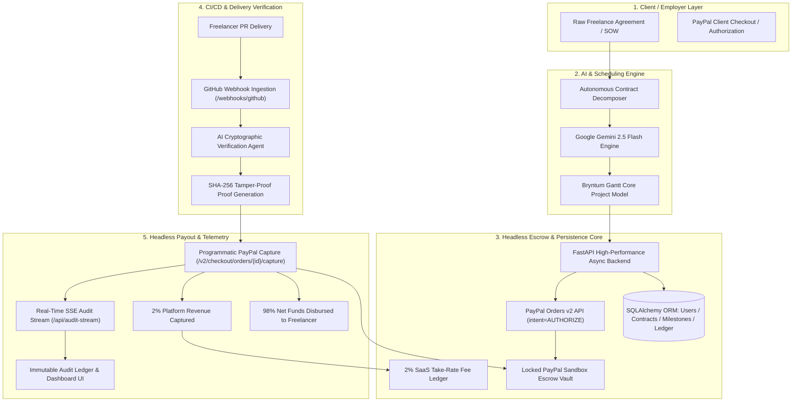
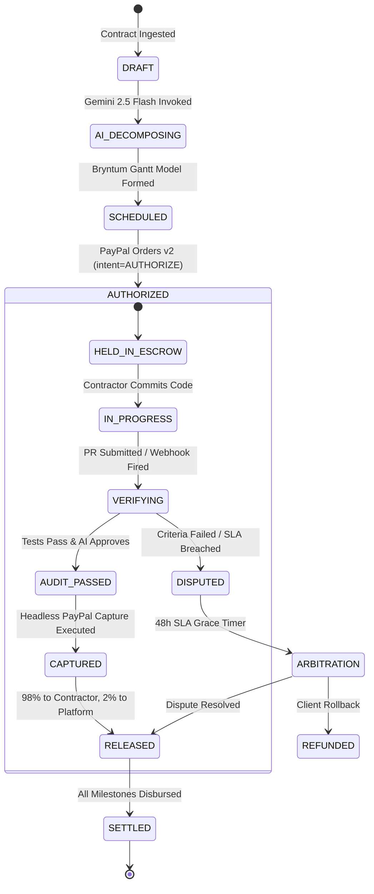

# 🏛️ MilestonePay AI Architecture & System Specification

## 1. High-Level System Architecture



---

## 2. End-to-End Autonomous Pipeline (ASCII)

```
=============================================================================================================================
                                     MILESTONEPAY AI END-TO-END ESCROW DATAFLOW
=============================================================================================================================

 [ Raw Contract / SOW ]
          │
          ▼
 [ Gemini 2.5 Flash ] ───────► Natural Language Clause Decomposition into Tasks, Durations & Criteria
          │
          ▼
 [ Bryntum Gantt Tree ] ─────► End-to-Start (Type 2) Dependencies, Critical Paths & JSON Schemas
          │
          ▼
 [ PayPal Orders v2 ] ───────► POST /v2/checkout/orders (intent: "AUTHORIZE") Locks 100% of Escrow
          │
          ▼
 [ Locked Escrow Vault ] ────► PayPal Sandbox Holds Total Budget (Protected from Unauthorized Drain)
          │
          ▼
 [ Freelancer Submits PR ] ──► GitHub Webhook: POST /api/webhooks/github (action: "closed", merged: true)
          │
          ▼
 [ AI Verification Agent ] ──► Automated Unit/Integration Tests (>90% coverage) & Criteria Audit
          │
          ▼
 [ SHA-256 Proof Signed ] ───► Immutable Cryptographic Receipt Hash Created
          │
          ▼
 [ Headless Capture ] ───────► POST /v2/checkout/orders/{id}/capture Disburses Milestone Allocation
          │
          ├──► 98% Net Amount Routed to Freelancer PayPal Account
          └──► 2% Take-Rate Fee Recorded into SaaS Platform Revenue Ledger
          │
          ▼
 [ Real-Time SSE Ledger ] ───► EventSource Stream Emits Verified Transaction Proof to Live UI
=============================================================================================================================
```

---

## 3. Escrow State Machine



---

## 4. Security & Cryptographic Proof Specification

For each milestone payout, an immutable cryptographic receipt is generated:
$$\text{Proof} = \text{SHA-256}\Big(\text{"MILESTONE\_PAY\_AI"} \,\|\, \text{MS\_ID} \,\|\, \text{Commit SHA} \,\|\, \text{Amount} \,\|\, \text{Audit Score} \,\|\, \text{Timestamp}\Big)$$

This proof is simultaneously:
1. Passed in the PayPal Capture API request note (`note_to_payer`).
2. Stored in the SQLAlchemy database `audit_logs` table.
3. Broadcasted in real-time over the Server-Sent Events (`/api/audit-stream`) to connected browser clients.
